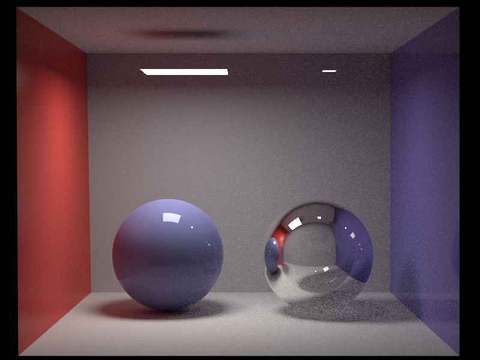

# Caramel

Caramel is a physically-based offline renderer for studying myself based on [Peanut](https://github.com/pjessesco/peanut). 

## Features
- Path tracing (with multiple importance sampling)
- Area light
- `.obj` format meshes
- Perspective camera
- Octree acceleration structure
- Möller–Trumbore ray tracing
- End-to-end render test

## Gallery

<table>
  <tr>
    <td>ajax</td>
    <td>cbox</td>
    <td>diamonds</td>
  </tr>
  <tr>
    <td></td>
    <td></td>
    <td></td>
  </tr>
 </table>

