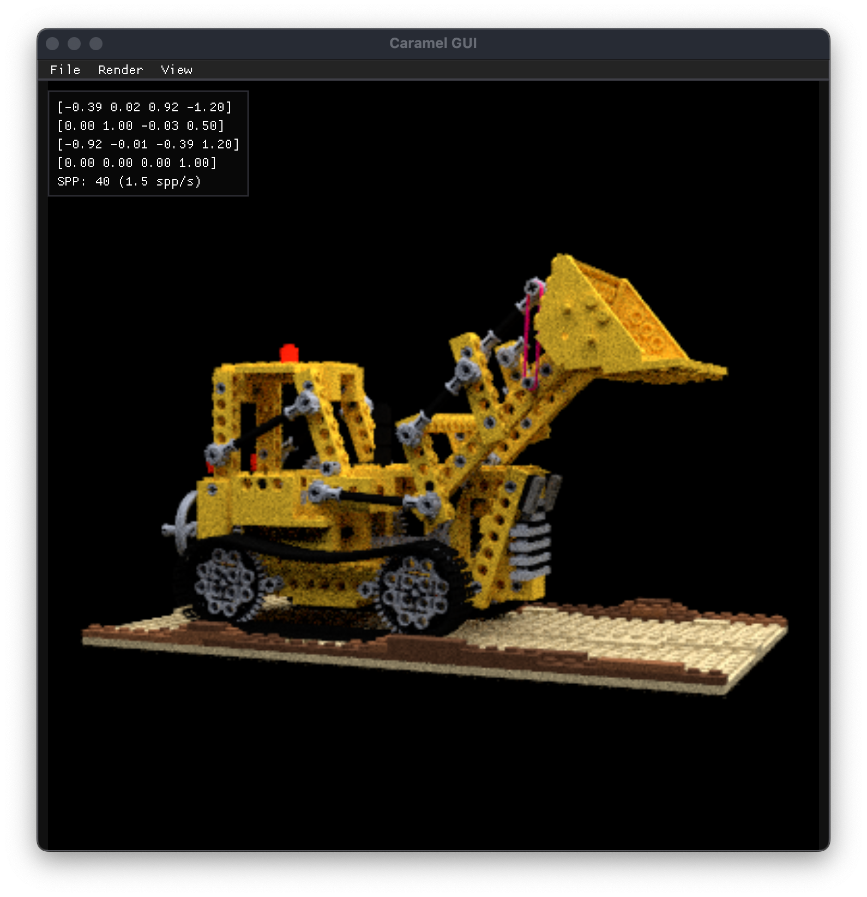

# Caramel

Caramel is a physically-based offline renderer based on [Peanut](https://github.com/pjessesco/peanut). 

## Gallery

See [caramel-scenes](https://github.com/pjessesco/caramel-scenes/blob/main/README.md) README.

## Features

- Integrators
  - Path tracing (with multiple importance sampling, Russian roulette)
  - Visualization integrators (Depth, Normal, UV, HitPos)
- BSDFs
  - Diffuse, Mirror, Dielectric, Conductor, Microfacet, Oren-Nayar, TwoSided
- Lights
  - Point light, Area light (solid angle sampling), Image (MIS compensation) and constant environment light
- Camera
  - Pinhole and thin lens (depth of field)
- Geometry
  - `.obj`, `.ply` format meshes
  - Octree, BVH acceleration structure
  - Möller–Trumbore and watertight ray-triangle intersection
- Interactive render GUI (macOS)
- End-to-end render test

